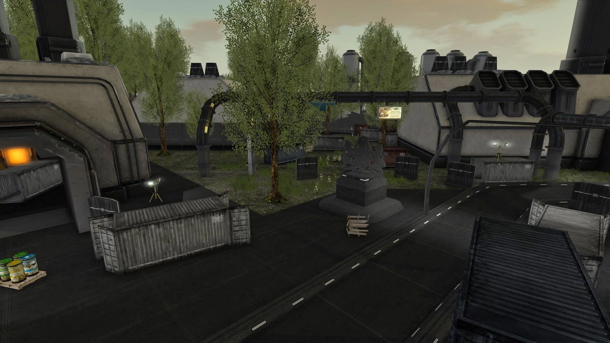

> Originally published: 2014-04-27
> Tags: alchemy, beta, release
> Authors: Ghost

That title sounds like a porno. Anyways, the time has come, we are releasing today.

Alchemy Viewer Beta 14.4.26 is now available for
download on our [Downloads](/downloads/) page. We
know that it's been a month over when we said we would actually be
releasing, BUT some things happened and we lost people and we are still
looking for people to join the project. 

If you're interested in joining
the project see the previous post, it gives you all sorts of information
and stuff. Compiled Binaries are available for Mac, Windows, and Ubuntu
12.04 (including distributions that have equivalent glibc and gcc
versions). 

So what are you waiting for? 

Go download some viewer for yourself, tell us how it goes!

### Here are a couple of screenshots for your enjoyment:

