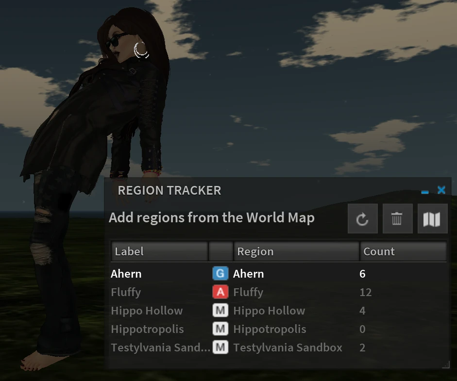
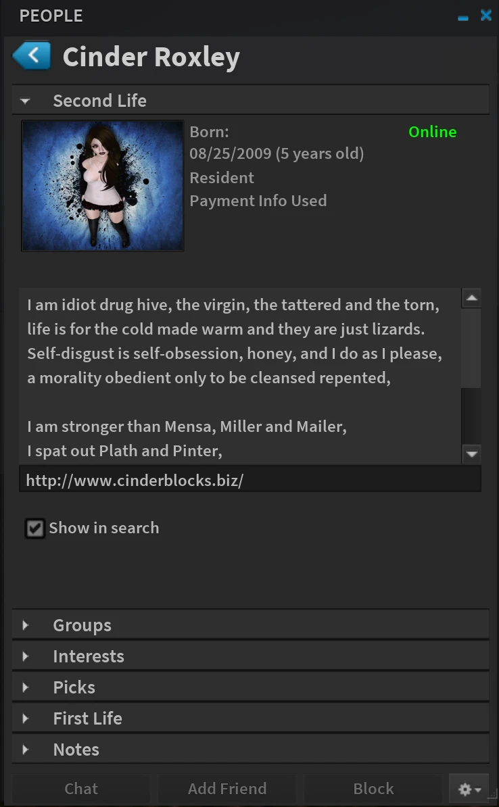
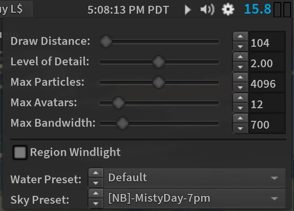

> Originally published: 2014-08-28
> Tags: alchemy, beta, profile, release
> Authors: cinder

It's been a while since you've heard from us. We've been diligently
updating and improving Alchemy. Along with keeping in sync with Linden
Lab's latest changes and improvements, we've spent months optimizing and
improving the codebase to make it blazingly fast and less susceptible to
crashes. Alongside that, we've been hard at work creating new features
and polishing up the interface. You may have read that Alchemy was
recently accepted into the Second Life® Third Party Viewer Directory
after going through the steps to self-certify to provide our users a
positive and predictable experience.

There's still a lot we want to accomplish before a final release, but we
were so excited to make it into the directory that the team has decided
to release a little taste of what we are working on to celebrate! This
beta release comes in both Windows64 and Mac64 flavors. (Other platforms
will follow in the next release.)

The first thing you're going to notice is the revamped UI. We've decided
that Adobe® Source Sans Pro is a little nicer on the eyes, and Sovereign
went to great lengths to push around the pixels and make everything fit
just right. Among the other easily found additions, Region Tracker,
letting you keep tabs regions gridwide from anywhere in Second Life;
Legacy Profiles, a new implementation designed from scratch and uniform
to the rest of our UI; and Quick Settings, easily accessible next to the
volume controls allowing you to change often used settings on the fly.
We've also updated and optimized all the viewer libraries to bring you
the best experience yet.

While those are some of the highlights, there's much more to be found!
Check out Preferences, where we've added more settings, and since this
is a beta, there's plenty tucked away that hasn't been exposed to the
UI yet, so check out the Debug Settings if you're feeling dangerous.
Ready to give Alchemy a try? Get started by downloading it [here](https://google.com).

Let us know what you think! One more reminder that this is a beta
release. If you find a bug or have an idea, don't be afraid to let us
know on our [bug tracker](http://alchemy.atlassian.net/) or our
[inworld group](secondlife:///app/group/8a5268a4-af8d-f2a5-6d82-29cd322210d1/about).
