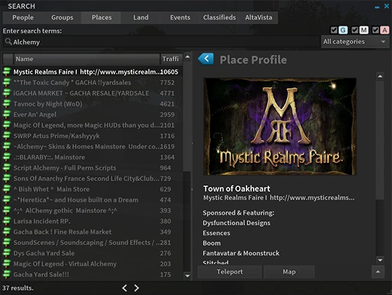
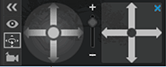
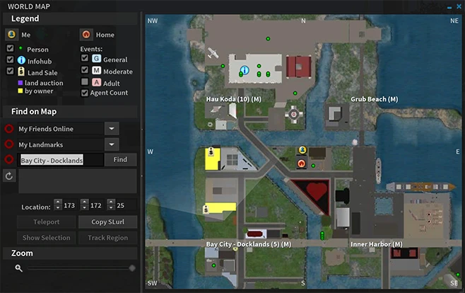
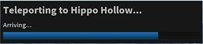

> Originally published: 2014-10-27

Woah, like woah! We are excited to see you all liking Alchemy so much. We have been working hard since last release ironing out bugs and improving the experience. This release is jam-packed with tasty goodness, and you're going to want to check it out. Here's the run down:

<!--truncate-->

## 💡 New Features
You wanted them, we made them. A great deal of planning and design goes into every feature we implement, and we're just getting started.

### 🔍 Search
Search has been revamped. Now you can search using both the legacy protocol and websearch, and it doesn't stop there. Results are displayed fully and completely. Search for a person, you immediately see their full profile. Search for a group, same thing. We covered all the bases.

### 🎥 Camera Controls
Camera controls are useful, to say the least, but having a big old honking window blocking your screen? Not helpful. So we took it out back, stomped on it until it was smaller, and made it collapsable. It's there when you need it, out of the way when you don't.

### 📍 World Map
Hey, I've got to say, I like the world map. It was a bit wasteful with space too though, so we took a step back and looked at it. Removed a lot of the unused space, and changed it around a bit. Take a look, make it your own.

### 🚀 Teleport Screen
Here's something I didn't like, the depressing void you get when you teleport. Inspired by Exodus Viewer, we give you something a little better.

### 👥 Groups, Events, People...
It doesn't stop there. Group panels have been redone. Event listings. It just gets better and better.

### 💬 Chat
Several requests were made to us regarding chat, and we delivered. Typing indicators are now show in nearby chat over an avatar's head and in instant message, you'll see a typing icon next to the person's name as they type. Don't want to allow other people to see your typing status? You can hide this in Preferences. Want an annoucement when someone's about to send you a message? We've added that too. Do you like writing novels and long soliloquies? Alchemy allows you to send messages up to 3096 characters! Did you talk to someone last night, but you can't quite remember their name? The recent people list is now saved for thirty days (or longer or shorter, it's up to you) so you can easily look them back up.

By request, you can also change the nearby chat channel for use with translators and scripts. Simply type /setchannel \<number\> to switch, and /setchannel 0 to change it back. We've got some other stuff in the works for next release, so stay tuned.

### ❗ Region Alerts
Are you the kind of person who likes to be notified of when people come and go? We've got region alerts for you. You can find them in our radar's gear menu.

### ➕ There's more!
These are just some of the more major changes. We'll let you explore and find the rest. We've exposed some of the hidden ones in Preferences, so make sure you take a look.

## ⚡ Performance Improvements
Our focus isn't just on making a beautiful viewer to use, we want it to be pain free and *fast*. More work has gone into stability and speed again. More than one hundred memory leak fixes, bottlenecks, and slowdowns were fixed in this release, and, as always, we build with the very latest libraries available upstream.

## 🧲 Improvements from Linden Lab
We make sure to keep up to date with Linden Lab's Second Life Viewer to make sure you get the latest and greatest work they put out. So we've got the new Snapshot UI. We've got Pipelining. We've got AIS3. Geenz Spad has even given us permission to release with his very cool reflection improvements. (Thanks Geenz!)

## 🛫 For future reference...
Yes, we know you want RestrainedLove API support! We plan on supporting the protocol, but we want to do it in the best way possible. Hang with us, and you're going to like what you see.

## 💾 Download it!

 Windows and Mac are available for this release, Linux is coming soon.

* Windows ( [x86][Windows x86] | [x64][Windows x64] )
* Mac OS X ( [Universal 32/64][Mac Universal] )
* [Full release notes][Release Notes]

We hope you enjoy this release from us. As always, bug reports can be filed on our [Issue Tracker](http://alchemy.atlassian.net) and you can find us inworld in the [Alchemy Viewer group](secondlife:///app/group/8a5268a4-af8d-f2a5-6d82-29cd322210d1/about). Let us know what you think! We have plenty more planned in the mean time. See you again soon!

[Windows x86]: https://bitbucket.org/alchemyviewer/alchemy/downloads/Alchemy_Beta_3_7_19_34077_i686_Setup.exe
[Windows x64]: https://bitbucket.org/alchemyviewer/alchemy/downloads/Alchemy_Beta_3_7_19_34077_x86_64_Setup.exe
[Mac Universal]: https://bitbucket.org/alchemyviewer/alchemy/downloads/Alchemy_Beta_3_7_19_34077_universal.dmg
[Release Notes]: https://alchemy.atlassian.net/wiki/display/ALCH/Alchemy+Beta+3.7.19.34077
