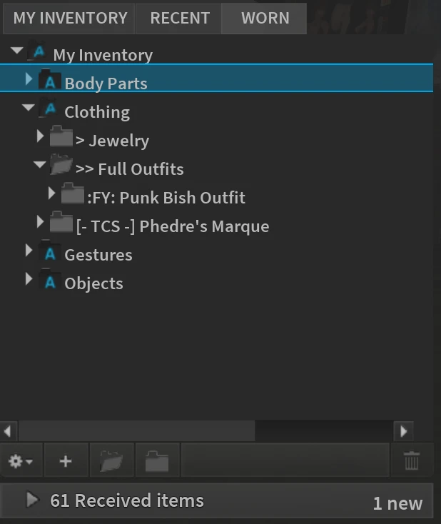
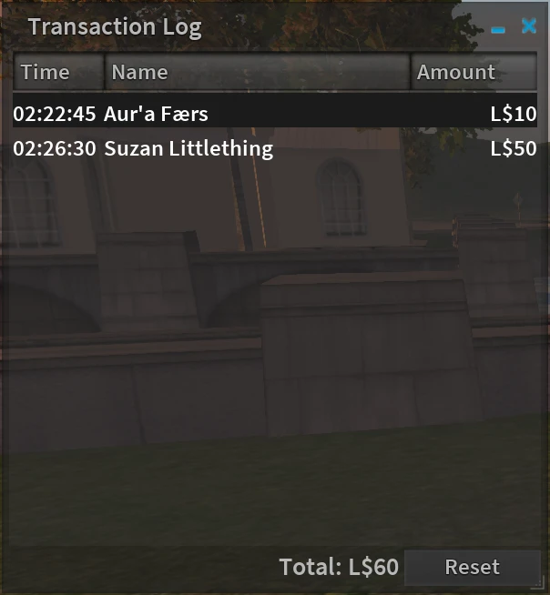
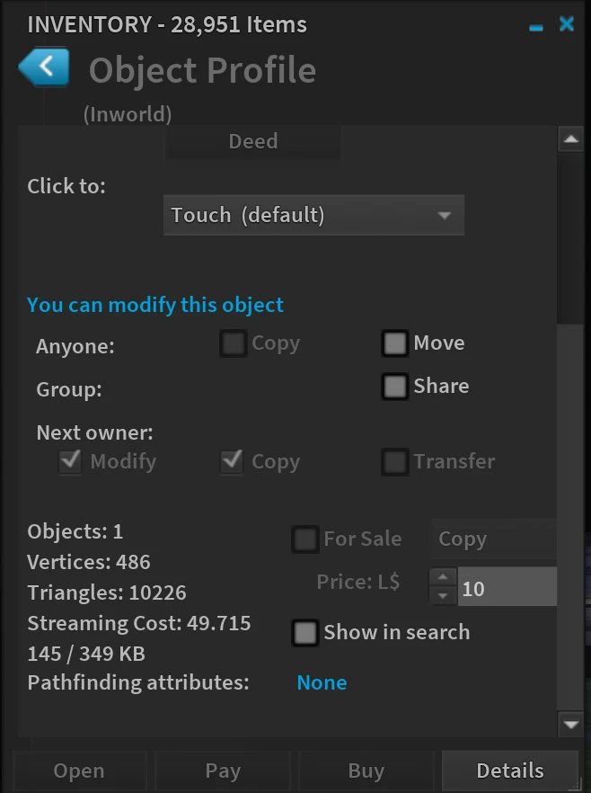
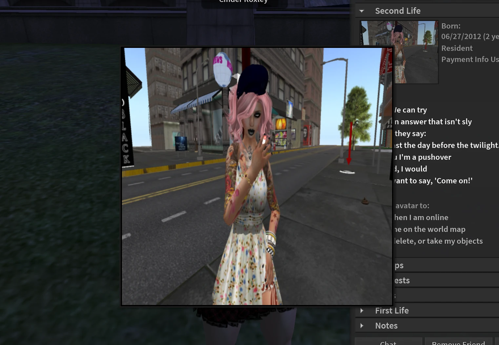

> Originally published: 2014-12-25
> Tags: alchemy, beta, release
> Authors: cinder

Salutations and holiday greetings from the Alchemy team! We are pleased to present you with a new beta release. This release focuses mainly on bug fixes and updates, but we've managed to squeeze in a few little additions as well. Here's a short breakdown:

<!--truncate-->

## ⚗️ Updates
As always, we stay on top of the latest code released by Linden Lab with our own little spin on it, so you've got the latest and greatest, and fixes? We've got 'em! So so many fixes. Doesn't that make you feel good?

## 💡 New Features
I mentioned we squeezed a couple new things in for you:

FMOD Studio - this change might not be immediately visible, but you'll surely hear it. FMOD Studio provides the latest in 3D audio in gaming.

By request, a Worn Items panel was added to inventory for those who prefer it.

We've also added a Transaction Log, useful for keeping short term track of tips, donations, and sales. Find it under the Me menu.

For the 3D mousers and machinimists out there, we've got a new Flycam Indicator that shows in the status bar letting you know you're in Flycam Mode. Stay tuned for our next release photographers and machinimists, we've got plenty cooking for you in an upcoming release!

For the creators, we have picked up Qarl's Tree and Grass picker from the Inworldz Viewer. Now you don't have to leave it to luck of the draw to get the tree you want.

Object profile also gives you more pertinent information on objects you inspect. Including triangle count, Total vertices, Streaming cost (aka Land Impact) so you can create more efficiently and shop smarter.

Another request, the ability to "zoom in" on profile and land pictures was also added. Just click a pic and you'll see.

All and all, this is a tidy little release to hold you over until some of our bigger projects are ready for release. You can find more details on what we added and what we fixed in the release notes. As always, if you have a suggestion or find a bug, please report it to us through our bug tracker or get in touch with us in our support group. Until next time, happy holidays!

## But wait, there's more
### Linux
This release also introduces our first Linux beta! We are supporting 64-bit only Linux distributions.
