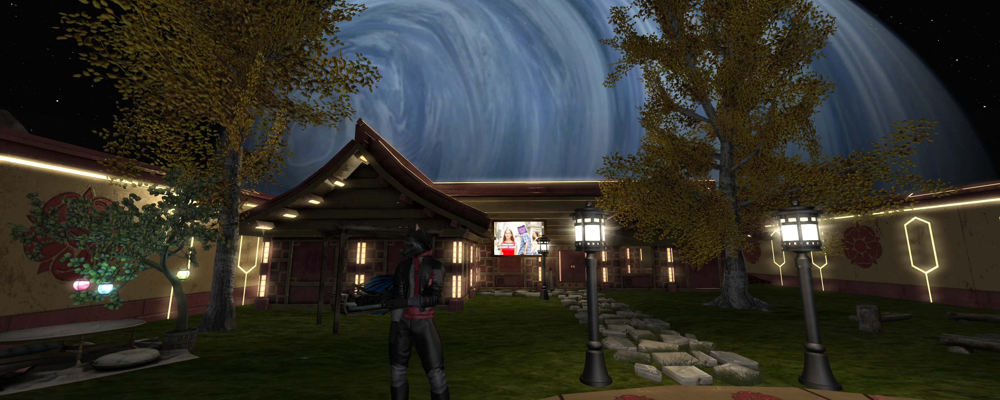

> Originally published: 2020-09-18
> Tags: alchemy
> Authors: rye

Hey all. Just wanted to give a small status update on Alchemy and where things are headed! 

I've been hard at working revamping the client for improved performance and overall less bugs. Some of the new features that we've integrated from Linden Lab such as the Environmental Enhancement Project have also required a lot of polish and general cleanup.

I'm sorry for the delays in getting a new Beta out these past few months and some the issues that have been encounted with the current build. Just wanted to let everyone know we're all still alive and well. 

Here's a screenshot of some of what we've been working on!

And also feel free to join us in our Discord! 
[Discord Invite Link](https://discordapp.com/invite/KugCgs6)
